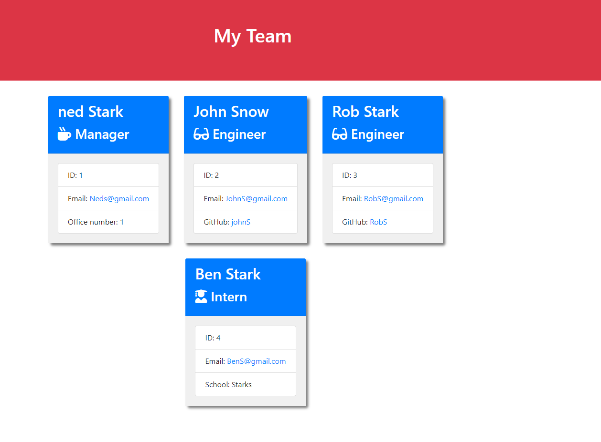
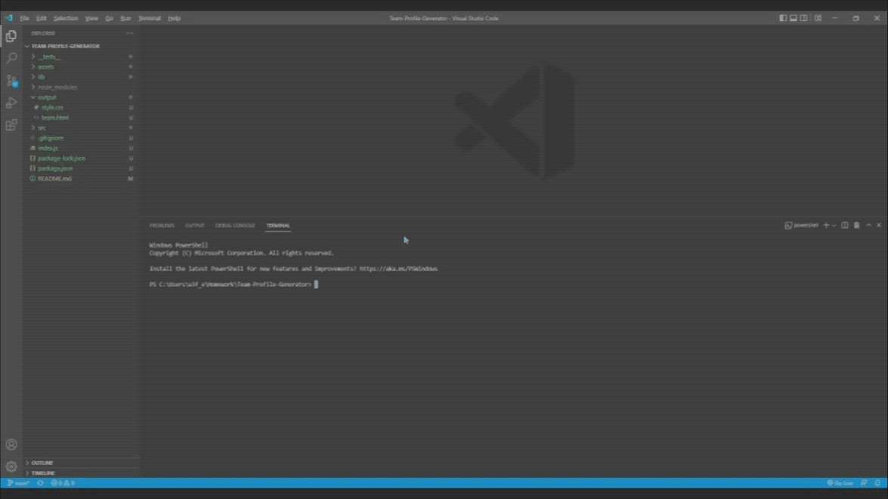

# Team-Profile-Generator
## Description 
This application was created to generate a team profile based on user input using the Inquirer module from Node.js and displaying the information on a newly created html page with a style sheet. This project demonstrates use of OOP and TDD using Jest. 

## Table of Contents

* [Installation](#installation)
* [Usage](#usage)
* [License](#license)
* [Walkthrough Video](#walkthrough-video)
* [Tests](#tests)
* [Questions](#questions)

## Installation 
The user should clone the repository from GitHub and download Node. This application also requires a file system and inquirer module. If testing is required, this application uses Jest. 

## Screenshot
This is a screenshot of the generated HTML webpage.

## Walkthrough Video

